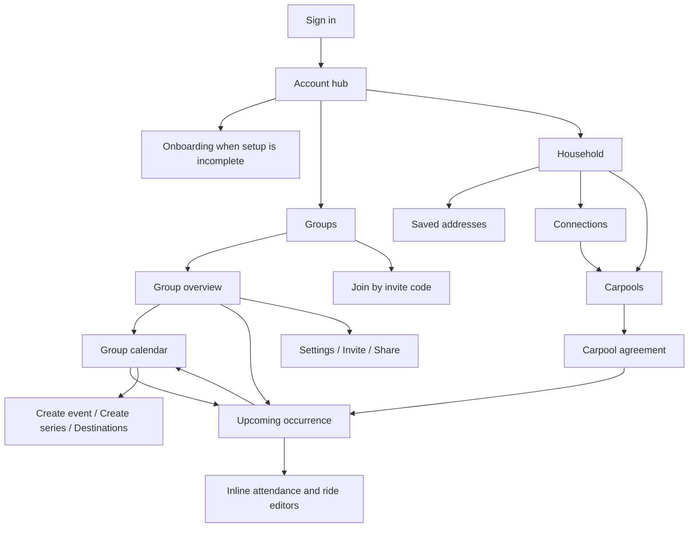

# RallyRoute route and navigation review

Reviewed 2026-10-07. This documents current behavior; no application routes or UI were changed during this review.

[Screenshot gallery](index.html) · [Screenshot folder](screenshots/) · [Source route inventory](routes.json) · [Capture metadata and visible links](manifest.json)

## Navigation tree

There are **34 page routes**, including **5 placeholders**. Indented namespace nodes without a page are labelled explicitly. Slug names below describe their domain; the source uses `[slug]`, `[eventSlug]`, `[householdSlug]`, and `[locationSlug]`.

```text
RallyRoute
├── /sign-in                                  Public email/code sign-in
├── /join                                     Invitation code; shell when signed in
├── /onboarding                               Authenticated household setup; standalone
├── /                                         Home tab — PLACEHOLDER
├── /account                                  Actual post-login account/household hub
├── /calendar                                 Calendar tab — PLACEHOLDER
├── /messages                                 Messages tab — PLACEHOLDER
├── /profile                                  Profile tab — PLACEHOLDER
├── /groups                                   Managed and joined groups
│   ├── /new                                  Create a group
│   └── /:groupSlug                            Group overview; next 7 days of events
│       ├── /settings                         Group settings — Owner/Admin
│       ├── /members                          PLACEHOLDER
│       ├── /events                           Group calendar: Month/Week/Day/Agenda
│       │   ├── /new                          Create one-off event — Owner/Admin
│       │   ├── /series/new                   Create recurring series — Owner/Admin
│       │   └── /destinations                 Destination management — Owner/Admin
│       └── /:eventSlug                        Concrete occurrence; attendance and rides
│           ├── /edit                         Edit occurrence — Owner/Admin
│           └── /recurring                    Edit series from occurrence — Owner/Admin
├── /group                                    Namespace only; no landing page
│   └── /:groupSlug                           Namespace only; no landing page
│       ├── /invite                           Direct group invitations — Owner/Admin
│       └── /share                            Reusable group links — Owner/Admin
├── /households                               Namespace only; no listing page
│   └── /:householdSlug                        Household, addresses, participant cards
│       ├── /settings                         Settings/access; management is role-gated
│       ├── /locations                        Saved address cards
│       │   ├── /add                          Add address — household Owner/Admin
│       │   └── /:locationSlug/edit            Edit address — household Owner/Admin
│       ├── /connections                      Connection requests, contacts, pickup sharing
│       └── /carpools                          Household carpool list
│           └── /:carpoolId                    Concrete carpool agreement — UUID identifier
├── /group-invitations                        Namespace only; no landing page
│   ├── /open                                 Public fragment capture; then accept/sign-in
│   └── /accept                               Authenticated join preview; standalone
└── /household-invitations                    Namespace only; no landing page
    ├── /open                                 Public fragment capture; then accept/sign-in
    └── /accept                               Authenticated join preview; standalone
```

`/groups/:groupSlug/events/series` is a namespace without its own page. There is no dedicated group locations-management page; destinations live under `/groups/:groupSlug/events/destinations`. There is no separate participant-edit route: participant creation expands inline on the household page. Attendance and ride preferences also expand inline on occurrence pages. Destination editing/archival happens inline on the destinations route.

## Actual navigation paths



The fixed bottom navigation is **Home → `/`**, **Groups → `/groups`**, **Calendar → `/calendar`**, **Messages → `/messages`**, and **Profile → `/profile`**. Only Groups currently opens a completed feature area. The global Calendar tab does not open the implemented group calendar.

Sign-in redirects to `/account`. Account can redirect to a pending household/group invitation before checking setup completeness; incomplete profiles/household linkage redirect to `/onboarding`. Sign-out returns to `/sign-in`. The header household selector updates selection through a Server Action and cookie; it does not navigate to the selected household's route. A separate selector on Account/Household pages does navigate to a household URL.

## Findings

| Priority | Finding and evidence | Suggested follow-up |
| --- | --- | --- |
| High | **Household navigation is clipped on mobile.** At both 390px and 320px capture widths, the household page expands its layout viewport to 506px. The horizontal navigation pushes Participants and Household settings beyond the visible right edge; the fixed bottom bar also falls below the captured physical viewport. See `29-household.png`, `36-household-other-context.png`, and `42-household-320.png`. [Source](../../../src/app/(app)/households/[householdSlug]/page.tsx), household navigation at line 18. | Wrap or stack the household navigation and verify the visual viewport as well as `scrollWidth` versus `innerWidth`. |
| High | **The working account hub has no primary-navigation entry.** Login opens `/account`, but Home opens a placeholder and Profile offers no account/household link. A user navigating to Home, Calendar, Messages, or Profile has no direct link back to Account. Four of five bottom tabs are placeholders. [Navigation source](../../../src/components/shell/bottom-navigation.tsx), [Home](../../../src/app/(app)/page.tsx), [Profile](../../../src/app/(app)/profile/page.tsx). | Choose one persistent route to the working hub: make Home useful or point it at Account; connect Profile to account/household management. Clarify whether Calendar is global or group-specific. |
| Medium | **Header household and URL household can disagree.** `36-household-other-context.png` shows Example household in the header while the page displays Other own household. The header reads a selection cookie, while the body resolves its URL independently. The page selector also navigates without updating that cookie. [Header selection](../../../src/components/shell/mobile-app-shell.tsx), [navigating selector](../../../src/app/households/forms.tsx). | Define one consistent selection rule when entering household routes, and communicate which household an action affects. |
| Medium | **Group members see editing links they cannot use.** Group overview event cards always include Edit Occurrence and, for recurring events, Edit Series. Non-admin visitors then get permission notices instead of editors. See `44-group-as-member.png` and the overview link rendering. [Source](../../../src/app/(app)/groups/[slug]/page.tsx). | Hide management links for Members while retaining server/database authorization. |
| Medium | **Signed-in shell behavior differs across join flows.** `/join` has the household header and bottom navigation; invitation acceptance and onboarding remain standalone pages. See `09-join.png`, `08-onboarding.png`, `39-group-invitation-accept.png`, and `41-household-invitation-accept.png`. | Decide whether standalone acceptance/setup is intentional; otherwise apply the same authenticated wrapper consistently. |
| Low | **Group invitation URLs use a different namespace.** Invite/Share use `/group/:groupSlug/...`; overview/settings/events use `/groups/:groupSlug/...`. This matches the current implementation and the earlier requested routes, but makes the URL hierarchy less predictable. [Path helper](../../../src/lib/groups/paths.ts). | Consider a future coordinated consolidation with explicit compatibility handling; do not silently change existing URLs. |
| Low | **Group Members is a placeholder with no current entry link.** `/groups/:groupSlug/members` exists, but the group overview presents only an active-household count. [Page](../../../src/app/(app)/groups/[slug]/members/page.tsx). | Implement and link the route when membership browsing is needed, or remove the unused placeholder deliberately. |

## Access and URL behavior

- Routes under `(app)` require authentication and include the shared shell. Group and household context helpers resolve slugs using authenticated Supabase access; unknown/inaccessible slugs use a generic 404.
- Group settings, Invite, and Share return 404 to non-admins. Event creation/management pages instead return a readable permission notice without mutation forms. Editing also checks occurrence status/time.
- Household address add/edit routes require household management access; ordinary household Members can view saved cards. Household settings retain permitted self-service actions such as leaving.
- Event UUIDs are internal; occurrence URLs use group/event slugs. Carpool detail URLs intentionally retain their UUID. Location slugs are scoped to the household.
- Calendar `date` and `view` query values are validated. Occurrence links carry `calendarDate` and `calendarView` for the Group events return link. `focus` is used after series creation/replacement. Household selection is cookie-based; legacy `household` occurrence query values do not override the header selection.
- Invitation `/open` routes consume the URL fragment and remove it before making a request. Captures do not persist invitation fragments or hashes. These entry routes are not regular navigation destinations.
- Server Action modules under `src/app/events`, `groups`, `households`, etc. are not additional page routes. No App Router `route.ts` HTTP handlers were found.

## Capture scope and reproduction

The gallery contains **47 mobile states** covering all **34 page routes**, with viewport PNGs and full-page variants for long screens. Most captures use **390 × 844** with touch/mobile emulation and `America/New_York`; household/calendar checks also use **320 × 844**. All content is synthetic. No live account was accessed, and no linked database records were changed.

The populated states include a group Owner, a group Member, saved household addresses, recurring occurrences, attendance/ride summaries, destination forms, and a pending carpool invitation. Group invitation acceptance shows a valid preview; household acceptance shows the unavailable-invitation state for the current account. The `/open` captures show missing-fragment recovery, not a real invitation. The review includes expected 404 states for a Member opening group settings and an unknown group.

This is a route/navigation and visual review, not a new audit of linked Supabase authorization. Synthetic mocks cannot establish live RLS correctness. The capture metadata records HTTP responses, requested and layout viewport dimensions, shell presence, header household, and visible internal links. Expected 404 console resource errors are retained in the manifest.

Run from the repository root:

```bash
LD_LIBRARY_PATH=/tmp/rallyroute-browser-libs/root/usr/lib/x86_64-linux-gnu \
  pnpm exec playwright test --config playwright.routes.config.ts
node scripts/render-route-review.mjs
```

The library path is only needed on this server's browser installation. `ROUTE_REVIEW_DIR` can select a different output folder. The capture configuration uses an isolated production server on port 3100 and the existing synthetic provider on port 54329; it leaves the app on port 3000 running. The report's written findings should be revisited when regenerating screenshots after application changes.
